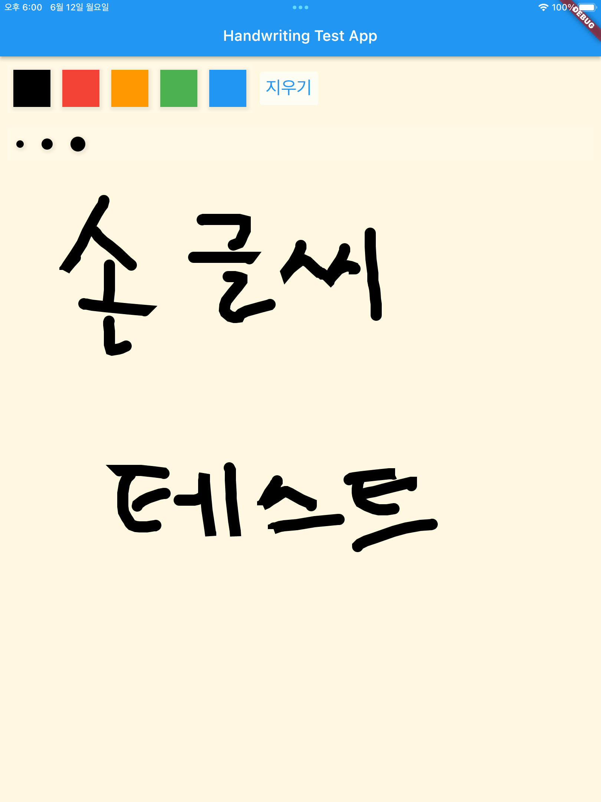

# 플러터 필기 테스트 앱 (가칭)

## 개요
플러터를 이용한 필기 앱 및 필기를 이미지로 저장하는 기능 개발을 위한 테스트 앱입니다.

## TODO
- [x] `CustomPainter`로 그림판 구현
- [x] 팔레트 구현
- [x] Provider(의존성 주입용) 및 FlutterBloc(상태관리) 적용
- [ ] 필압 지원
- [x] 필기 저장 기능 구현
